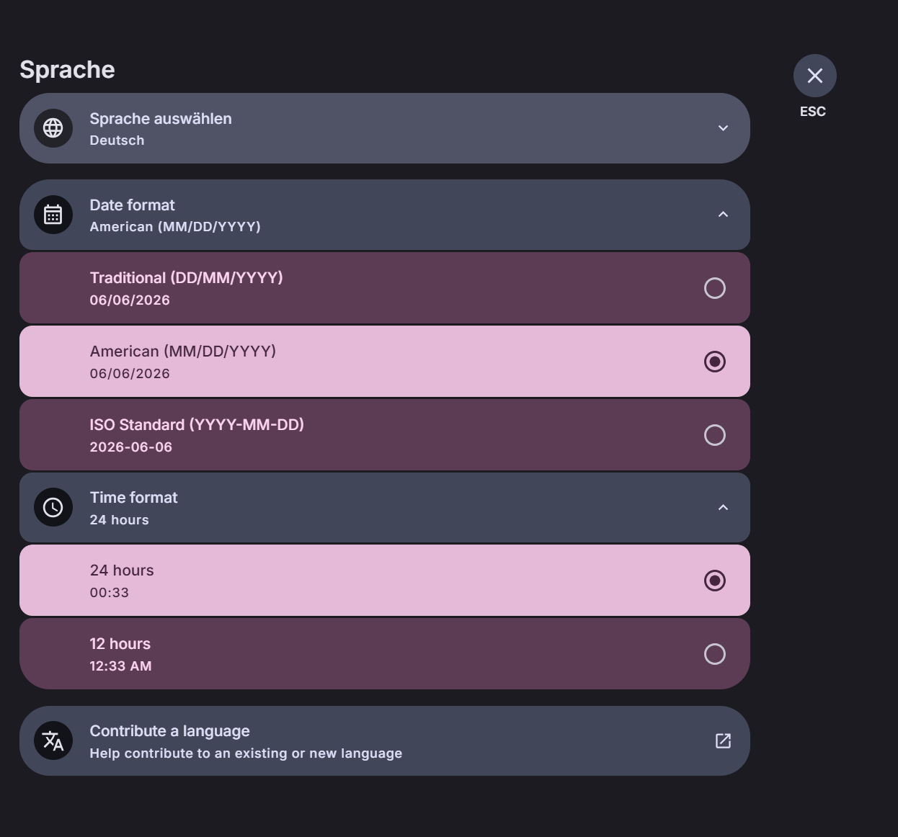

# Contribution [1]: Locales that doesn't fit the patterns of date and time have odd results

**Contribution Number:** 1  
**Student:** Kameti Kumbi
**Issue:** [[GitHub issue link](https://github.com/stoatchat/for-web/issues/629)]  
**Status:** [Phase III] [In Progress]

---

## Why I Chose This Issue

I chose this issue because it seemed like a good match for my current skills and interests. Since I have experience with JavaScript and frontend development, I felt comfortable working on a bug that affects the user interface and user experience. I was also interested in learning more about how applications handle different languages, regions, and date/time formats. The issue is well documented, labeled as a good first issue, and has a clear explanation of the problem, which makes it a great opportunity to contribute to an open-source project while continuing to build my skills.

---

## Understanding the Issue

### Problem Description

[In your own words, what's broken or missing?]

### Expected Behavior

[What should happen?]

### Current Behavior

[What actually happens?]

### Affected Components

[Which parts of the codebase are involved?]

---

## Reproduction Process

### Environment Setup

**OS:** Windows 11

**Tools Required:**
- Git
- mise-en-place (task runner)
- Node.js (v24.16.0) — installed via `winget install OpenJS.NodeJS.LTS`
- pnpm (v11.3.0) — installed via `npm install -g pnpm`

**Challenges & Solutions:**

**Challenge 1: `node` not recognized in pnpm postinstall scripts**

After installing mise and running `mise install:frozen`, pnpm's postinstall scripts (for esbuild) kept failing with `'node' is not recognized as an internal or external command`. This happened because pnpm spawns child `cmd.exe` processes that couldn't find mise's managed Node binary.

*What was tried (didn't work):*
- Adding mise shims to user PATH via PowerShell
- Running `mise exec -- pnpm install`
- Running `mise activate powershell`

*What finally worked:*
- Installing Node.js directly via `winget install OpenJS.NodeJS.LTS`
- Adding `C:\Program Files\nodejs` to the **system** PATH via System Properties → Environment Variables → System variables
- Running pnpm directly using its full path from **cmd.exe** (not PowerShell):

```cmd
C:\Users\<username>\AppData\Roaming\npm\pnpm install --frozen-lockfile
```

**Challenge 2: `mise build:deps` also failed with the same node error**

The `mise build:deps` task also spawned child processes that couldn't find node. Instead of using mise tasks, each dependency was built manually:

```cmd
C:\Users\<username>\AppData\Roaming\npm\pnpm --filter stoat.js run build
C:\Users\<username>\AppData\Roaming\npm\pnpm --filter solid-livekit-components run build
C:\Users\<username>\AppData\Roaming\npm\pnpm --filter @lingui-solid/babel-plugin-lingui-macro run build
C:\Users\<username>\AppData\Roaming\npm\pnpm --filter @lingui-solid/babel-plugin-extract-messages run build
```

**Challenge 3: Blank page — missing i18n catalogs**

The app loaded but showed a blank page with the error:
```
does not provide an export named 'messages'
```
The lingui catalogs needed to be compiled in TypeScript format specifically:

```cmd
C:\Users\<username>\AppData\Roaming\npm\pnpm --filter client exec lingui compile --typescript
```

Then the old `messages.js` file had to be deleted since the app was still loading the stale CommonJS version:

```cmd
del packages\client\components\i18n\catalogs\en\messages.js
```

**Challenge 4: Vite cache serving stale files**

Even after recompiling, Vite kept serving the old cached file. Fix:

```powershell
Remove-Item -Recurse -Force packages\client\node_modules\.vite
```

**Challenge 5: Missing brand assets**

The app showed SVG import errors for the Stoat wordmark and icons. Fixed by pulling brand assets:

```cmd
mise assets
```

**Challenge 6: Dev server command**

The README says `mise dev` but that also fails on Windows due to the node PATH issue. The working command to start the dev server is:

```cmd
cd packages\client
npx vite
```

**Final working startup sequence (run from project root):**

```cmd
C:\Users\<username>\AppData\Roaming\npm\pnpm install --frozen-lockfile
C:\Users\<username>\AppData\Roaming\npm\pnpm --filter client exec lingui compile --typescript
mise assets
cd packages\client
npx vite
```

Then open http://localhost:5173

---

### Steps to Reproduce

1. Log into the app at http://localhost:5173
2. Click the **gear/settings icon** to open User Settings
3. Navigate to the **Language** section
4. Change the language to **Deutsch (German)**
5. Click on the **Date format** dropdown
6. Observe: only three hardcoded options are available — `Traditional (DD/MM/YYYY)`, `American (MM/DD/YYYY)`, and `ISO Standard (YYYY-MM-DD)`. German's native format `DD.MM.YYYY` (with dots) is not available, and there is no "Automatic" or "Default" option to use the locale's native format.
7. Click on the **Time format** dropdown
8. Observe: only "24 hours" and "12 hours" are available — no "Automatic" option to revert to the locale's default format
9. Switch language back to **English** — the date format does not reset, confirming there is no way to return to locale-default without manually picking a preset

**Expected behavior:** An "Automatic" option should exist for both date and time format that uses the selected locale's native format by default.

**Actual behavior:** Only hardcoded presets are available. Many locales (German, Spanish, Bulgarian, Indonesian, Japanese, etc.) use formats that don't match any of the three presets, and once a format is manually selected there is no way to revert to the locale default.

---

### Reproduction Evidence

- **Branch link:** https://github.com/Kameti77/for-web/tree/fix-issue-629
- **Screenshots:** Confirmed bug visible in Language settings with Deutsch selected — date format shows only slash-based presets, no locale-native dot format, no Automatic option
 
- **My findings:** The bug is consistently reproducible. Switching to any locale that uses a non-standard separator (dots, periods) or a non-standard time format exposes the missing "Automatic" option. The three hardcoded date presets only cover slash and dash separators, leaving out a large number of locales.

---

## Solution Approach

### Analysis

[Your analysis of the root cause - what's causing the issue?]

### Proposed Solution

[High-level description of your fix approach]

### Implementation Plan

Using UMPIRE framework (adapted):

### Understand

The date/time format only allows hard-coded presets; however, many locale formats don’t match any of them. For example: e.g. German uses `DD.MM.YYYY`, Spanish uses `H:mm`. There's no "Automatic" option that uses the locale's native days format. When users switch languages, the picker still shows the old value (or no match), and there's no way to revert to the locale's default.

### Match (similar patterns in codebase)

- `dayjs.tsx:81` — `L: options.dateFormat ?? useLocale.formats.L` already falls back to the locale's native format when no override is set. This is exactly the "automatic" behavior. It is important to expose `undefined`/`null` as the "no override" state.
- `Locale.ts:65-72` — `clean()` stores `options.dateFormat`/`options.timeFormat` only when they are strings; `undefined` means "use locale default". This already supports clearing the override.

### Root Cause

In `Language.tsx:118`, the `value` prop of `CategoryButton.Select` is set to `timeLocale()[1].formats.L` (the resolved format, after the locale override is applied). So once a user picks a format, the picker always matches one of the hard-coded options. There is:

1. No "Automatic" option in the `options` map.
2. No way to set `dateFormat`/`timeFormat` back to `undefined` to clear the override.
3. No `clearDateFormat`/`clearTimeFormat` method on `Locale`.

### Plan - high level

1. **Add `clearDateFormat()` and `clearTimeFormat()` to `Locale.ts`** — these delete the stored option and call `updateTimeLocaleOptions({ dateFormat: undefined, timeFormat: undefined })` to fall back to the locale native format.
2. **Add an "Automatic" option to both pickers in `Language.tsx`** — keyed by a sentinel value (e.g. `"auto"`). When selected, call `locale.clearDateFormat()` / `locale.clearTimeFormat()`.
3. **Fix the `value` binding** — instead of `timeLocale()[1].formats.L` (which always resolves to the actual format string), use the stored override value from `locale.get().options.dateFormat ?? "auto"`. This makes the picker correctly show "Automatic" when no override is set.

#### Files to Touch

| File | Change |
| --- | --- |
| `packages/client/components/state/stores/Locale.ts` | Add `clearDateFormat()` and `clearTimeFormat()` methods |
| `packages/client/components/app/interface/settings/user/Language.tsx` | Add "Automatic" option to both pickers; fix `value` binding to use stored option not resolved format |
|  |  |

### Implement

[[Fork Branch Link](https://github.com/Kameti77/for-web/tree/fix-issue-629)]

### Review

According to `GUIDELINES.md`:

- Comment above the new methods (`clearDateFormat`, `clearTimeFormat`)
- No prop destructuring. Use `splitProps` if adding new Solid props
- 2-space indentation
- Commit message convention: check `git log` — the project uses `fix: <description>` style (conventional commits)

### Evaluate

**Manual testing:**

1. Switch to German → date picker should auto-select "Automatic" showing `DD.MM.YYYY`
2. Switch to Spanish → time picker should auto-select "Automatic" showing `H:mm`
3. Pick an explicit override → switch language → confirm it **stays** on the explicit override (not reset)
4. Select "Automatic" explicitly after an override → confirm it reverts to locale default

---

## Testing Strategy

### Unit Tests

- [ ] Test case 1: [Description]
- [ ] Test case 2: [Description]
- [ ] Test case 3: [Description]

### Integration Tests

- [ ] Integration scenario 1
- [ ] Integration scenario 2

### Manual Testing

[What you tested manually and results]

---

## Implementation Notes

### Week 3 Progress

### Implementation Progress

**Status: Tasks 1 and 2 of 3 complete.**

**Task 1 — Store: added `clearDateFormat` and `clearTimeFormat` (complete)**

Added two new methods to `Locale.ts` that allow clearing a saved date or time format override, reverting the app back to the locale's native default. Previously the store only had `setDateFormat` and `setTimeFormat` with no way to undo an override.

- **File modified:** `packages/client/components/state/stores/Locale.ts`
- **What was added:** `clearDateFormat()` and `clearTimeFormat()` methods that call `this.set("options", "dateFormat", undefined)` and `updateTimeLocaleOptions({ dateFormat: undefined })`

**Task 2 — Fix value binding in pickers (complete)**

Fixed the `value` prop in both `PickDateFormat` and `PickTimeFormat` so the picker correctly reflects the user's stored preference instead of always reading the resolved locale format. Previously, if a user's locale had a non-matching native format, the picker would highlight nothing.

- **File modified:** `packages/client/components/app/interface/settings/user/Language.tsx`
- **What was changed:** `value={timeLocale()[1].formats.L}` → `value={locale.get().options.dateFormat ?? "DD/MM/YYYY"}` and `value={timeLocale()[1].formats.LT}` → `value={locale.get().options.timeFormat ?? "HH:mm"}`

**Task 3 — Add "Automatic" option to both pickers (in progress)**

Not yet implemented. This is the final task — adding the "Automatic" key to both dropdowns and wiring it up to call `clearDateFormat` / `clearTimeFormat` when selected.

---

### Challenges Faced

**Understanding the data flow** — The hardest part was tracing how the format value flows from the store → dayjs → the UI picker. The `value` prop on the picker reads from `timeLocale()[1].formats.L` which is the *resolved* dayjs locale format, not the *stored* user preference. These are two different things and that distinction is key to understanding both the bug and the fix.

**TypeScript strictness** — The `set()` method on the store needed to accept `undefined` for the clear methods to work. Needed to verify the existing `clean()` function already handles `undefined` gracefully (it does — it only saves a value if `typeof input === "string"`, so passing `undefined` naturally skips saving it).

**AI as a tool, not a crutch** — Used Claude to help trace the codebase and understand unfamiliar patterns (SolidJS reactivity, the AbstractStore pattern). Every suggestion was reviewed and understood before being applied. The goal was to understand *why* each change works, not just copy it.

---

### Testing Strategy

This project has no unit test infrastructure for stores. Testing was done manually:

**Task 1 verification:**

- Ran `npx tsc --noEmit` in `packages/client` to confirm TypeScript compiles cleanly with the new methods

**Task 2 verification:**

- Ran the dev server and navigated to Settings → Language
- Selected `DD/MM/YYYY` explicitly and confirmed the picker highlighted that option
- Refreshed the page and confirmed the selection persisted

**Task 3 (planned):**

- Will manually test the full matrix: switching locales, picking Automatic after an override, verifying locale-native formats display correctly for German, Spanish, and Azerbaijani

### Week [Y] Progress

[Continue documenting as you work]

### Code Changes

- **Files modified:** [List]
- **Key commits:** [Links to important commits]
- **Approach decisions:** [Why you chose certain approaches]

---

## Pull Request

**PR Link:** [GitHub PR URL when submitted]

**PR Description:** [Draft or final PR description - much of the content above can be adapted]

**Maintainer Feedback:**
- [Date]: [Summary of feedback received]
- [Date]: [How you addressed it]

**Status:** [Awaiting review / Iterating / Approved / Merged]

---

## Learnings & Reflections

### Technical Skills Gained

[What you learned technically]

### Challenges Overcome

[What was hard and how you solved it]

### What I'd Do Differently Next Time

[Reflection on your process]

---

## Resources Used

- [Link to helpful documentation]
- [Tutorial or Stack Overflow post that helped]
- [GitHub issues or discussions that helped]
